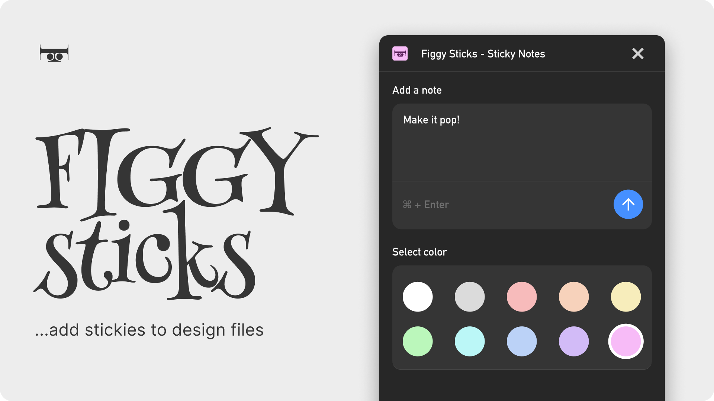

# Figma Sticky Notes Plugin



Figgy Sticks helps you create vibrant stickies in your Figma design files with ease. A clean UI and handy keyboard shortcuts let you add multiple notes quickly—less clicks, more sticks!

## Features

- Create sticky notes with customizable colors
- Add text to notes directly on the canvas
- Automatically includes the user's name at the bottom of each note

## How to Use

1. Run the plugin from the Figma plugins menu
2. Enter your note text in the text area
3. Select a color from the color grid
4. Click or use the keyboard shortcut to quickly add a note (or multiple)

## Development

This plugin is built using:

- TypeScript
- Figma Plugin API

To build the plugin:

```bash
npm install
npm run build
```

## Installation

Find it on the Figma Community
https://www.figma.com/community/plugin/1478109446396282175/figgy-sticks-sticky-notes
